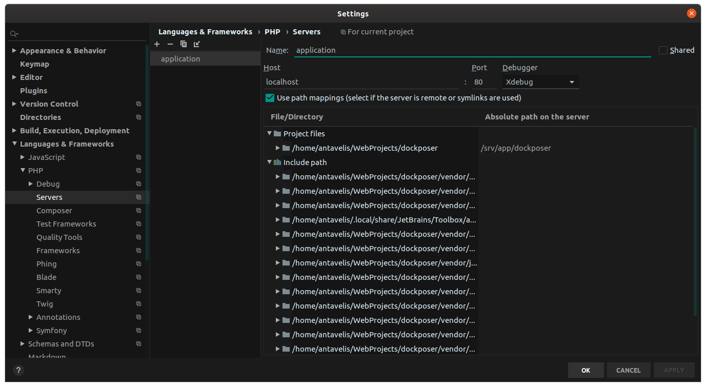

# Dockposer

Dockposer is a composer plugin that automatically generates and keeps in sync docker files with php extensions declared in composer.json.

The goal of this composer plugin is to keep in sync the PHP extensions/dependencies that you have declared in the `require` section of your composer.json file, with your docker files.
When you declare a dependency, e.g `ext-amqp`, in your composer.json this package will automatically generate the required docker instructions to install pecl amqp extension in your docker images.
Furthermore this package will sync the required php version with the version of the official docker image that gets pulled.

It is considered a good practice to declare your system's dependencies in the composer.json file, quote from getcomposer.org:

> ext-<name> allows you to require PHP extensions (includes core extensions). Versioning can be quite inconsistent here, so it's often a good idea to set the constraint to *. An example of an extension package name is ext-gd

With this composer-plugin by declaring the PHP extensions in your composer.json, you get the additional benefit of keeping in sync the required extensions with your dockerfile definitions.

## Installation

1. Require the plugin.
    ```shell script
    composer require ntavelis/dockposer --dev
    ```
2. Run `composer install` or `composer update` to execute it.

## Prerequisites

The package will generate `docker` and `docker-compose` files. So I assume you have them installed in your system.
## How it works

This packages gets triggered every time the composer tries to resolve your dependencies, e.g `composer install` or `composer update` will trigger this package to run. Even if no dependencies are going to be installed.

Dockposer will read the `require` section of your composer.json file and will generate docker instructions to install the php extensions you have declared in your `require` section. PHP extentions have the `ext` prefix, e.g. `ext-amqp`, `ext-ldap`.
It will also read your declared PHP version in the `require` section of composer.json and will generate FROM instruction in docker file to pull the official docker image with the same version. If the version is not declared will default to the php version that run the composer. 

It does not only generate the instructions, but it keeps them in sync. Any given time the require section of composer.json will be in sync with the docker instructions, leaving you only to think  how you will create your app.

### First execution
The first time you will run this package it will generate the below files:

| File Name          | Location                    | Description                                                              |
|--------------------|-----------------------------|--------------------------------------------------------------------------|
| docker-compose/yml | . (project root)            | docker-compose file, initializes the project's containers                |
| Dockerfile         | ./docker/nginx/Dockerfile   | Dockerfile which contains instructions for the creation of nginx image   |
| default.conf       | ./docker/nginx/default.conf | Nginx configuration, configures nginx.                                   |
| Dockerfile         | ./docker/php-fpm/Dockerfile | Dockerfile which contains instructions for the creation of php-fpm image |

YOU CAN modify any file, dockposer is smart enough to update the contents of the docker files inside the marked regions.

### Syncing of dependencies

Every time you run `composer install` or `composer update` dockposer will look your `require` section and if needed it will take action to sync the docker files.

If there was an update in the docker files, do not forget to run `docker-compose --build` to rebuild your images, so that they include the dependencies you required.

## Marked regions

As mentioned above, dockposer updates the contents of the marked regions. A marked region starts and ends with this type of comment. ``###> %s ###``.

For example if you have declared as a dependency, `ext-ldap` inside the composer.json file, dockposer will generate this section in `./docker/php-fpm/Dockerfile` 

```dockerfile
###> ntavelis/dockposer/php-extensions ###
COPY --from=mlocati/php-extension-installer /usr/bin/install-php-extensions /usr/bin/
RUN install-php-extensions \
	ldap
###> ntavelis/dockposer/php-extensions ###
```
As you keep adding or removing PHP extensions as dependencies in your composer.json file, you will see that this sections gets automatically updated, to be in sync with your dependencies.
Of course dockposer doesn't want to get in your way, so you are free to modify the Dockerfile outside the marked regions.
If you do not want dockposer to maintain a section, simply delete it, dockposer will figure it out and will not maintain the given region, which means of course that you will lose some functionality.

## Configuration

You can configure the names of the files, and the directory names, currently the below configuration is being supported by dockposer.

| Configuration Key   | Default value      | Description                                                                                                                                   |
|---------------------|--------------------|-----------------------------------------------------------------------------------------------------------------------------------------------|
| docker_compose_file | docker-compose.yml | The name of the docker-compose file, it is highly recommended not to change this, since it is what docker-compose expects to find by default. |
| docker_dir          | docker             | The directory name, where the Dockerfiles and the config files will be kept.                                                                  |
| nginx_docker_dir    | nginx              | The subfolder inside docker folder, e.g. ./docker/nginx where the files for the creation of the nginx image will be kept.                     |
| nginx_config_file   | default.conf       | The name of the nginx configuration file.                                                                                                     |
| fpm_docker_dir      | php-fpm            | The subfolder inside docker folder, e.g. ./docker/php-fpm where the files for the creation of the php-fpm image will be kept.                 |
| dockerfile_name     | Dockerfile         | The name of the Dockerfiles, applies to both e.g ./docker/nginx/Dockerfile and ./docker/php-fpm/Dockerfile                                    |

In order to change the configuration you need to add it in the composer.json under `extra` key. Example:

```json
...
   "extra": {
        "dockposer": {
            "docker_dir": "docker_rules"
        }
    },
...
```

Note: When changing a folder, or a file name, all the references to it will use the name you specified.

## List of supported extensions

Under the hood in the dockerfile definitions we use the shell scripts from [mlocati/docker-php-extension-installer](https://github.com/mlocati/docker-php-extension-installer) repository.

Please refer [here](https://github.com/mlocati/docker-php-extension-installer#supported-php-extensions) for a list of supported php extensions you can install.

If an extension is pre-installed inside the official docker images, and you declare it in the composer.json, we will not generate any docker instructions for the given library.

Pre-installed PHP extensions inside official php images:

* core
* ctype
* curl
* date
* dom
* fileinfo
* filter
* ftp
* hash
* iconv
* json
* libxml
* mbstring
* mysqlnd
* openssl
* pcre
* pdo
* pdo_sqlite
* phar
* posix
* readline
* reflection
* session
* simplexml
* sodium
* spl
* sqlite3
* standard
* tokenizer
* xml
* xmlreader
* xmlwriter
* zlib

## PHP Frameworks

### Symfony
For Symfony the official docker image covers you, you just need to install this package and run `composer install` and `docker-compose up`. 

### Laravel

For Laravel, you need the bcmath extension that it is NOT pre-installed inside official docker images. Check Laravel requirements [in Laravel docs](https://laravel.com/docs/master/installation#server-requirements). 

1. Install the package by following the [installation instructions](#installation).
2. Add bcmath extention to require section of composer.json
    ```json
    "require": {
            "ext-bcmath": "*",
    }
    ```
3. Run `composer install` to trigger the plugin to run.
4. Run `docker-compose up` to initialize containers.
 
## How to debug package with xdebug - For contributing to this repository

### Environment setup
1. Given the following phpstorm config:


    * Note: here we name the server configuration as `application`, this name should match the `PHP_IDE_CONFIG="serverName=application"` in the command for debugging.

    * Note: it is a good idea to uncheck this configuration from phpstorm, settings -> langauges & frameworks -> debug -> uncheck: Force break at first line when no path mapping specified.

2. Create another project on the same level as this package. So you have the below directory structure:
`/home/antavelis/webprojects/dockposer` -> clone of the package inside here
`/home/antavelis/webprojects/demoapp` -> a php application with a composer.json file

3. In the demoapp location require the local version of the dockpose package:

    ```json
    {
        "type": "project",
        "license": "proprietary",
        "require": {
            "php": "^7.2.5",
            "ext-ctype": "*",
            "ext-iconv": "*",
            "ntavelis/dockposer": "dev-master"
        },
        "repositories": [
            {
                "type": "path",
                "url": "../dockposer"
            }
        ]
    }
    ``` 

    * Note: the url path must point to the location of the package. Composer will symlink the package and it will recognize it as a plugin.

4. You will need docker and docker-compose, please install them before preceding.

### Execute the debug command
1. Navigate to the package's root directory, e.g `/home/antavelis/webprojects/dockposer`
2. Navigate to docker folder: `cd ./docker`
3. Setup a break point in phpstorm, somewhere in the code, e.g. in the class `src/DockposerPlugin.php`
4. Execute:
    ```shell script
    docker-compose run --rm -e PHP_IDE_CONFIG="serverName=application" -e COMPOSER_ALLOW_XDEBUG=true phpserver-dockposer bash -c 'cd /srv/app/demoapp; php -d xdebug.remote_host=172.17.0.1 /usr/local/bin/composer install' 
    ```
    * Note: This environmental variable `COMPOSER_ALLOW_XDEBUG=true` instructs composer to NOT disable xdebug, so that we can debug our application. 